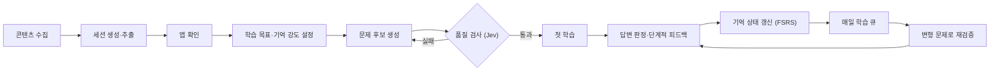
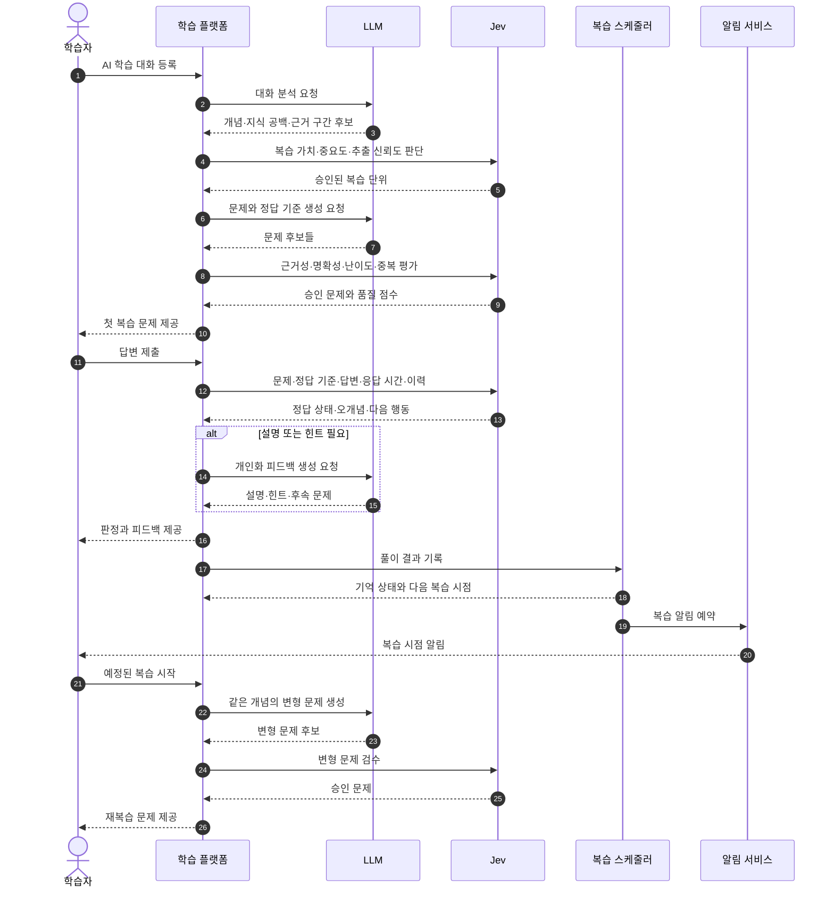

# AI 대화 기반 개인화 복습 플랫폼

> AI는 설명하지만, 우리는 기억하게 한다.

- 문서 상태: 아이디어 및 해커톤 기획 초안
- 작성일: 2026-09-27
- 조사 범위: AI 학습 대화 분석, 문제 생성, 적응형 복습, LLM·Jev 결합 구조

## 1. 개요

이 서비스는 사용자가 ChatGPT, Claude, Gemini 등과 나눈 학습 대화를 등록하면 대화 속 개념과 지식 공백을 분석하고, 이를 개인화된 문제와 반복 복습 일정으로 전환하는 학습 플랫폼이다.

단순히 대화를 요약하거나 플래시카드로 변환하는 것이 아니라 다음 질문에 답하는 것을 목표로 한다.

- 사용자는 대화 전에 무엇을 몰랐는가?
- 어떤 부분을 반복해서 질문하거나 잘못 이해했는가?
- 지금 스스로 설명할 수 있는가?
- 어떤 문제를 언제 다시 풀어야 장기 기억으로 전환되는가?

핵심 제품 정의는 다음과 같다.

> AI 대화에서 드러난 사용자의 지식 공백을 찾아내고, 잊기 직전에 다른 형태의 문제로 다시 확인하는 개인 학습 메모리 시스템

## 2. 문제 정의

생성형 AI는 어려운 개념을 빠르게 설명하지만, 일반적인 대화 경험은 장기 학습을 보장하지 않는다.

현재 사용자가 겪는 흐름은 대체로 다음과 같다.

```text
모르는 내용을 AI에게 질문
→ 설명을 읽고 이해했다고 느낌
→ 대화를 종료
→ 며칠 후 세부 내용을 잊음
→ 같은 내용을 다시 검색하거나 질문
```

여기에는 네 가지 문제가 있다.

### 2.1 이해와 회상의 차이

설명을 읽을 때 알아보는 것은 비교적 쉽지만, 아무런 단서 없이 내용을 다시 떠올리거나 새로운 상황에 적용하는 것은 별개의 능력이다.

간격을 둔 인출 연습은 몰아서 반복하는 것보다 기억 유지에 유리하다는 연구 근거가 있다. 29개 연구를 분석한 메타분석에서는 간격을 둔 인출 연습의 강한 효과가 보고되었다.

- [A Meta-Analytic Review of the Benefit of Spacing out Retrieval Practice Episodes on Retention](https://eric.ed.gov/?id=EJ1310148)
- [The science of effective learning with spacing and retrieval practice](https://doi.org/10.1038/s44159-022-00089-1)

### 2.2 AI 대화가 일회성 정보로 남음

유용한 대화를 나누더라도 해당 내용은 대화 목록에 묻힌다. 사용자가 직접 다시 찾아 읽거나 별도의 학습 도구로 옮기지 않는 한, 체계적인 복습으로 연결되지 않는다.

### 2.3 AI가 만든 문제의 품질 편차

LLM에 단순히 문제나 플래시카드 생성을 요청하면 중요하지 않은 정보, 너무 긴 답, 모호한 문제, 대화에 근거하지 않은 내용이 포함될 수 있다. 사용자 커뮤니티에서도 불필요한 카드와 품질 검수 부담이 반복적으로 언급된다.

- [ChatGPT가 불필요한 Anki 카드를 생성한다는 사용자 사례](https://www.reddit.com/r/ChatGPT/comments/1katea0/need_help_chatgpt_generating_tons_of_useless_anki/)
- [AI 생성 플래시카드의 정확성과 관련성 문제](https://www.reddit.com/r/Anki/comments/1mewr8p/problem_with_aigenerated_flashcards/)

### 2.4 개인의 이해 상태가 누적되지 않음

일반적인 퀴즈 생성기는 자료의 내용을 기준으로 문제를 만든다. 그러나 실제 학습에는 사용자가 어디에서 막혔고 어떤 오개념을 반복했는지가 더 중요하다.

## 3. 시장 및 수요 근거

AI를 학습에 사용하는 사용자 기반은 이미 크며 계속 확대되고 있다.

- OpenAI에 따르면 미국 대학생 연령대의 3분의 1 이상이 ChatGPT를 사용하고, 이들이 보내는 메시지의 약 4분의 1은 학습·학교 관련이다. [출처](https://openai.com/global-affairs/college-students-and-chatgpt/)
- Pew Research Center의 2024년 미국 청소년 조사에서는 26%가 학교 공부에 ChatGPT를 사용한다고 답했으며, 이는 전년 13%에서 증가한 수치다. [출처](https://www.pewresearch.org/short-reads/2025/01/15/about-a-quarter-of-us-teens-have-used-chatgpt-for-schoolwork-double-the-share-in-2023/)
- 진학사가 한국 고등학생 3,525명을 조사한 결과, 47.7%가 주 1회 이상 AI를 공부에 사용했고, 이용자들이 가장 많이 선택한 활용 방식은 어려운 개념에 대한 설명 요청이었다. 다만 이는 정부 통계가 아닌 기업 설문이다. [출처](https://edu.chosun.com/site/data/html_dir/2026/03/11/2026031180121.html)

이 서비스가 해결하려는 문제는 AI 사용 자체가 아니라 다음 단계의 공백이다.

```text
AI로 이해하기
        ↓ 현재 단절
스스로 떠올리기
        ↓
오개념 교정하기
        ↓
장기적으로 기억하기
```

## 4. 경쟁 환경

대화나 자료를 플래시카드와 퀴즈로 바꾸는 시장은 이미 경쟁이 치열하다.

### 4.1 직접 경쟁 서비스

| 서비스 | 주요 기능 | 아이디어와 겹치는 정도 |
|---|---|---:|
| [CardsGPT](https://www.cardsgpt.ai/) | ChatGPT 대화에서 개념을 추출해 플래시카드 생성, 간격 반복 | 매우 높음 |
| [Flashly](https://flashly.dev/) | ChatGPT·Claude 대화를 Chrome 확장으로 수집하고 플래시카드 생성 | 매우 높음 |
| [Memochat](https://memochat.app/en) | ChatGPT 공유 링크를 플래시카드·퀴즈·노트로 변환 | 매우 높음 |
| [Web Highlights](https://www.web-highlights.com/blog/turn-chatgpt-conversations-into-flashcards/) | AI 답변을 선택해 카드로 만들고 간격 반복으로 학습 | 높음 |
| [Recall](https://recall.cards/) | AI 대화 안에서 카드를 생성하고 복습 일정 관리 | 높음 |
| [Gradiuz](https://gradiuz.com/) | 문서·대화를 퀴즈와 카드로 전환하고 약점 추적 | 높음 |

### 4.2 플랫폼 경쟁

대형 AI 플랫폼도 동일한 방향으로 확장하고 있다.

- ChatGPT는 대화나 업로드한 노트에서 인터랙티브 플래시카드를 생성하고, 이를 라이브러리에 저장하며, 맞히지 못한 카드를 다시 연습하는 기능을 제공한다. [공식 안내](https://help.openai.com/en/articles/20001533-flashcards-in-chatgpt)
- NotebookLM은 업로드한 자료에 근거한 퀴즈와 플래시카드, 난이도 조절, 오답 해설과 원문 인용을 제공한다. [공식 발표](https://blog.google/innovation-and-ai/models-and-research/google-labs/notebooklm-student-features/)
- Gemini Study Notebooks는 학습 목표를 세분화하고 강점·취약 영역과 우선 학습 항목을 추적한다. [공식 발표](https://blog.google/innovation-and-ai/products/gemini-app/gemini-study-notebooks/)

### 4.3 경쟁 분석 결론

다음 제안만으로는 차별화하기 어렵다.

> “AI 대화를 넣으면 플래시카드와 퀴즈를 만들어준다.”

제품의 중심을 콘텐츠 변환이 아니라 학습자의 지식 상태에 두어야 한다.

## 5. 차별화 전략

### 5.1 대화 내용이 아니라 대화 과정 분석

대화에는 사용자의 지식 상태를 추론할 수 있는 신호가 포함된다.

- 처음 질문한 개념
- 설명을 듣고 다시 질문한 부분
- 사용자가 잘못 바꾸어 말한 내용
- AI에게 확인을 반복한 내용
- 예시를 요청한 부분
- 마지막까지 명확히 해결되지 않은 부분

서비스는 대화의 핵심 내용을 그대로 카드로 만드는 대신 이런 신호를 이용해 지식 공백을 생성한다. 이 신호는 첫 학습의 문제 선정, 힌트와 개념 설명, 기억 항목의 초기 상태에 쓴다(§7, §6.4.2). 다른 서비스는 사용자가 앱에서 틀려야 약점을 알지만, 이 서비스는 대화하던 순간에 이미 안다.

### 5.2 정적 카드가 아닌 동적 문제

같은 개념을 복습하더라도 문제 표현과 요구하는 사고 수준을 바꾼다.

```text
정의 회상
→ 개념 비교
→ 사례 판단
→ 오류 찾기
→ 새로운 상황에 적용
→ 자신의 말로 설명
```

이를 통해 사용자가 카드의 문장 자체를 외우는 문제를 줄인다.

### 5.3 모든 문제에 원본 근거 연결

생성된 문제와 정답은 반드시 원본 대화의 근거 구간을 가져야 한다. 사용자는 문제 생성 이유와 답의 출처를 확인할 수 있다.

### 5.4 문제 생성과 문제 판단의 분리

LLM이 문제 후보를 생성하고, 별도의 판단 단계가 문제의 품질과 적합성을 검사한다.

```text
LLM: 가능한 문제를 다양하게 생성
Jev: 어떤 문제가 실제로 사용할 만한지 판정
스케줄러: 언제 다시 보여줄지 계산
```

### 5.5 요청하지 않아도 이어지는 장기 학습

AI 채팅에서 복습하려면 학습자가 매 세션 "퀴즈 내줘"라고 직접 요청해야 하고, AI는 다음 날 먼저 불러주지 않는다. 세션이 끝나면 학습도 끝난다.

이 서비스는 저장 이후의 과정을 자동화하고, 듀오링고처럼 학습을 습관으로 만든다.

- 대화를 저장하면 학습 세션이 만들어지고 첫 학습이 바로 준비된다.
- 이후에는 요청하지 않아도 앱이 여러 세션에서 오늘 필요한 지식을 골라 짧은 매일 학습으로 제공한다(§6.4.4).
- 연속 학습 일수, 예상 소요 시간, 알림으로 복귀를 유도한다(§7.7).

자동화와 습관은 "왜 계속 돌아오는가"에, 대화 과정 분석(§5.1)은 "왜 효과가 있는가"에 답한다. 자동 수집과 간격 반복만으로는 CardsGPT·Recall 같은 서비스와 구분되지 않으므로 둘을 함께 제시한다.

## 6. LLM과 Jev의 역할

### 6.1 LLM

LLM은 선택지를 미리 정할 수 없는 생성 작업을 담당한다. 추출은 가능한 한 **사용자의 AI(커넥터)**에 맡기고, 서버 LLM은 추출 이후 작업에 쓴다.

| 작업 | 커넥터 입력 (Claude) | 공유 링크·붙여넣기 입력 (ChatGPT 등) |
|---|---|---|
| 발화 분류, AI 판정 추출, 복습 단위 추출 | 사용자의 AI가 `save_learning_session` 인자로 작성 (서버 비용 0) | 서버 LLM이 같은 스키마(§7.6)로 추출 |
| 문제·정답 기준·힌트·변형 문제 생성 | 서버 LLM | 서버 LLM |

커넥터 우선인 이유: 원문을 받더라도 요약·추출에는 LLM이 필요하다. 서버 API로 처리하면 비용이 발생하고, 비용 때문에 사용자가 쓰는 모델보다 성능이 낮은 모델을 쓰게 된다. 사용자의 AI는 대화 전체 맥락을 이미 가지고 있다.

- 대화에서 개념과 설명 추출
- 사용자의 질문과 잠재적 오개념 요약
- 문제 후보 생성
- 정답 기준과 해설 생성
- 힌트와 추가 설명 생성
- 동일 개념의 변형 문제 생성

### 6.2 Jev

Jev는 미리 정의한 선택지와 평가 기준 안에서 반복되는 판단을 담당한다.

- 사용자의 AI가 보낸 복습 단위와 학습 신호 검수 (복습 가치, 근거 연결의 타당성)
- 문제의 원문 근거성 평가
- 문제의 명확성·난이도·중복도 평가
- 답변이 정답 기준을 충족했는지 판정 (객관식 제외, §6.4.5)
- 다음 학습 행동 선택
- 신뢰도가 낮은 결과를 자동 처리에서 제외

예상 판정 형태는 다음과 같다.

```text
답변 판정 (§6.4.5):
- verdict: met / not_met / unable_to_judge
- failures: omission / contradiction / misread (not_met일 때, 해당하는 것 모두)

다음 행동:
- advance
- retry
- give_hint
- explain_concept
- generate_variant
- relearn_today
- request_confirmation
```

- `relearn_today`는 같은 세션이나 그날 큐 안에서 다시 묻는 것만 뜻한다(§6.4.8). 하루를 넘는 복습 시점은 Jev가 정하지 않고 FSRS가 계산한다(§6.3).

### 6.3 일반 코드와 스케줄러

정확한 수치 계산과 상태 관리는 모델이 아니라 일반 코드가 담당한다.

- 응답 시간 측정
- 문제 및 풀이 기록 저장
- 정답률과 힌트 사용률 계산
- 기억 상태 갱신
- 다음 복습 시점 계산
- 알림 예약

망각 예상 날짜는 Jev나 LLM에게 직접 질문하지 않고 FSRS로 계산한다(§6.4).

### 6.4 FSRS 기억 모델

복습 스케줄러는 FSRS를 쓰며, 다음 복습일 계산뿐 아니라 기억 상태 표시와 매일 학습 선별에도 같은 상태를 쓴다. FSRS는 기억 항목마다 세 값을 관리한다.

| 값 | 의미 |
|---|---|
| D (난이도) | 항목 자체가 얼마나 어려운가 (1~10) |
| S (안정도) | 기억이 버티는 기간. 회상 확률이 90%로 떨어지기까지 걸리는 일수 |
| R (회상 확률) | 지금 떠올릴 수 있는 확률. 마지막 복습 이후 경과 시간과 S로 계산하며, 시간이 지날수록 떨어지고 S가 클수록 천천히 떨어진다 |

복습마다 평가 하나(Again / Hard / Good / Easy)를 입력하면 D와 S가 갱신되고, 목표 유지율에서 다음 복습 시점이 나온다. 해커톤은 공개 기본 파라미터를 쓰고, 목표 유지율은 세션의 기억 강도로 정한다(§6.4.7).

스케줄러는 java-fsrs로 구현하며 learning·relearning steps와 간격 흔들기(fuzz)를 끈다. 같은 날 재확인은 앱 정책(§6.4.8)이 맡고, FSRS는 모든 등급에 일 단위 간격을 준다. 시간 이동 데모와 테스트 결과가 매번 같아야 하므로 간격을 무작위로 흔들지 않는다. 기억 상태는 항목이 첫 등급을 받을 때 만든다.

#### 6.4.1 기억 항목: 문제가 아니라 지식에 상태를 둔다

- 기억 항목은 복습 단위의 핵심 사실(`keyPoint`) 1개 또는 헷갈린 지점(`confusionPoint`) 1개다.
- 문제는 기억 항목 하나를 대상으로 생성하고, 같은 항목의 변형 문제는 기억 상태를 공유한다. 문제마다 상태를 두면 변형 문제가 새 카드처럼 처음부터 시작해 규칙 7(변형 문제로 재복습)이 성립하지 않는다.
- 복습 단위의 기억 상태는 소속 항목의 상태를 모아 표시한다(§6.4.3).

#### 6.4.2 대화를 0회차 복습으로 반영

대화 시각에 평가 1회를 기록해 기억 항목의 초기 D·S를 정한다. 다른 서비스는 앱에서 첫 풀이를 하기 전까지 사용자 상태를 모르지만, 이 서비스는 대화 신호로 0일차부터 약한 항목을 안다.

| 출처 발화 신호 | 초기 평가 |
|---|---|
| `aiVerdict` = corrected·partial | Again |
| `intent` = understanding_check·restatement 이고 `aiVerdict` = confirmed | Good |
| 그 외 (정보 요청만 있음) | 기록하지 않음. 앱의 첫 풀이가 첫 평가 |

- 출처 발화는 `keyPoint`의 `turns`, `confusionPoint`의 `turn`이다. 출처 발화가 여러 개면 가장 낮은 평가를 쓴다.
- 초기 평가에는 Again과 Good만 쓴다. 대화는 스스로 떠올린 기록이 아니라 설명을 들은 경험이므로, 회상 성공의 정도를 뜻하는 Hard·Easy는 의미가 맞지 않는다.
- 초기 평가는 사용자가 앱 확인 단계를 마친 뒤, 확인된 발화와 복습 단위로 한 번만 계산한다. 평가 시각은 대화 시각이다.
- 위 대응표는 초기안이며 벤치마크 대화로 조정한다.

#### 6.4.3 기억 게이지

- 기억 항목마다 현재 R을 "지금 기억할 확률 72%"처럼 보여준다. 시간이 지나면 줄고, 복습하면 회복된다.
- 복습 단위 게이지는 소속 항목 R의 평균이며, 가장 약한 항목을 함께 표시한다.
- 초기 평가가 없는 항목은 "아직 확인 전"으로 표시한다.
- 데모의 시간 이동(§11.3)에서 게이지가 떨어졌다가 복습 후 회복되는 장면을 보여준다.

#### 6.4.4 매일 학습 큐

- 후보: 모든 세션의 기억 항목 중 R이 그 항목의 목표 유지율(§6.4.7) 아래로 떨어진 항목.
- 우선순위 = (1 − R) × 가중치. 가중치는 헷갈린 지점 > `warning` 핵심 사실 > `fact`·`practice` 핵심 사실 순이며 수치는 조정한다.
- 시간 예산(기본 5분)에 맞춰 우선순위 순으로 자른다. 예상 소요 시간은 문제 유형별 기준 시간의 합이다.
- 같은 복습 단위의 항목은 하루에 1개만 낸다. 형제 항목끼리 서로 답의 단서가 되는 것을 막는다.
- 여러 세션의 항목을 섞어 하나의 큐로 제공한다.
- **신규 항목은 복습과 분리해 편성한다.** 아직 첫 풀이가 없는 항목(첫 학습 상한으로 다루지 못한 항목, 첫 학습 전인 새 세션의 항목)은 복습 후보에 넣지 않고 별도 신규 분량으로 둔다. 복습 분량을 먼저 채우고 남은 시간 예산 안에서 신규 항목을 하루 최대 3개(초기값) 편성한다. 신규 항목의 문제 유형은 세션의 학습 목표(§7.8)로 정한다.
- 반복해서 어려워하는 항목은 관련 선행 개념을 짧게 제안하고, 재학습 때문에 하루 분량이 계속 늘지 않도록 상한을 둔다.
- 며칠 쉬었다 돌아와도 하루 상한을 유지하고, 처리하지 못한 항목은 다음 큐로 넘긴다.

#### 6.4.5 등급 변환

Jev는 답변 내용만 판정하고, FSRS 등급은 코드가 정한다.

```text
문제 + 정답 기준 + 사용자 답변
    ↓
Jev: 기준 충족 판정 (verdict, failures, 신뢰도)   ← 객관식은 Jev 없이 코드가 채점
    ↓
코드: 신뢰도·도움 노출·자기평가 확인 → FSRS 등급 또는 보류
    ↓
FSRS: 기억 상태와 다음 복습 시점 갱신
```

**평가 대상 시도**

- 각 복습 기회의 첫 무도움 시도만 평가한다. 힌트를 본 직후의 재시도는 평가하지 않는다. 도움 후 성공이 최초 실패를 가리지 않게 하기 위해서다.
- 단계적 피드백의 경로(독립 정답, 힌트 후 정답, 설명 후 정답, 반복 오답)는 지식 상태 표시와 피드백에만 쓴다(§7 6단계).
- 지연된 무도움 재확인(§6.4.8)은 별도의 같은 날 복습으로 평가한다. 직전 설명의 영향이 남을 수 있으므로 독립 회상으로 간주하지 않고, 직전 도움 노출 여부와 경과 시간을 함께 기록한다.
- 질문 문구를 풀어 준 해석 도움은 내용 힌트가 아니다. 해석 도움 뒤의 첫 답은 무도움 시도로 본다.

**자기평가**: 답을 제출할 때 하나를 고른다.

- 쉽게 떠올렸음
- 힘들게 떠올렸거나 확신이 약함
- 떠올리지 못하고 추측했음

**Jev 출력**

| 필드 | 값 |
|---|---|
| `verdict` | `met`: 필수 기준을 모두 충족하고 모순 없음 / `not_met`: 필수 내용 누락 또는 틀린 내용 포함 / `unable_to_judge`: 정보 부족·모호성 등으로 판정 불가 |
| `failures` | `not_met`일 때 해당하는 이유를 모두 고른다. `omission`: 필수 내용 누락 / `contradiction`: 평가 대상 기준을 부정하거나 틀리게 주장 / `misread`: 질문을 다르게 이해함 |
| 신뢰도 | `verdict`와 `misread` 각각 |
| `repeatsUserBelief` | 헷갈린 지점 항목에서 `contradiction`이 대화 속 `userBelief`와 같은 내용인지 |
| `offTargetError` | 평가 대상과 무관한 부분의 틀린 내용. 등급에 반영하지 않고 기록만 한다 |

- 필수 기준을 언급했더라도 같은 답변에서 이를 부정하면 `not_met` + `contradiction`이다.
- 화면 표시와 오개념 기록에 쓰는 대표 이유는 `contradiction` > `omission` 순이다.
- `repeatsUserBelief`가 참이면 오개념 재발로 기록한다.

**변환표**: 위에서부터 처음 맞는 행을 적용한다.

| # | 첫 무도움 시도의 조건 | 처리 |
|---|---|---|
| 1 | `verdict` 신뢰도가 기준 미만, 또는 `unable_to_judge` | 보류 |
| 2 | `misread`가 기준 이상의 신뢰도로 확인됨 | 보류 |
| 3 | 정답이지만 추측 의심이 있고 자기평가로 확인되지 않음 (예: 문제를 읽기 어려운 시간 안에 고른 객관식 정답) | 보류. 근거를 묻는 짧은 질문으로 확인 |
| 4 | `not_met` (`misread` 신뢰도 부족 포함), 또는 "떠올리지 못하고 추측했음" | Again |
| 5 | `met` + "힘들게 떠올렸거나 확신이 약함" | Hard |
| 6 | `met` + 객관식이 아님 + "쉽게 떠올렸음" + 응답 시간이 기준을 크게 넘지 않음 | Easy (초기 정책, §12.2로 검증) |
| 7 | `met`, 나머지 | Good |

- 기억 갱신을 면제하는 이유(행 1~3)는 충분히 신뢰할 수 있을 때만 쓴다. `verdict`만 확실하고 `misread` 여부가 불확실하면 Again이다.
- "힘들게 떠올림"과 "확신이 약함"은 같은 뜻이 아니므로, 행 5는 FSRS Hard(정답이지만 회상에 어려움이나 의심이 있었음)의 근사인 초기 정책이다.
- 응답 시간과 첫 입력까지의 시간은 읽기·입력 습관의 영향을 받으므로 Easy를 막는 보조 조건으로만 쓰고, 시간만으로 Easy를 주지 않는다. 기준 시간은 문제 유형별로 정한다.
- 객관식은 Easy를 주지 않는 보수적 정책을 쓴다. 객관식(알아보기)과 주관식(회상)이 같은 기억 상태를 공유하는 것은 해커톤의 명시적 절충이며, 이 제한으로 측정 차이가 없어지지는 않는다.

**보류 처리**

- 보류된 항목은 기억 상태를 바꾸지 않고 다음 매일 학습 큐 후보로 남는다.
- 문제가 모호해서(`unable_to_judge`, `misread`) 보류됐다면 같은 문제를 다시 내지 않는다. 문제를 품질 검사로 돌려보내고, 수정하거나 변형한 문제로 다시 확인한다.
- 같은 항목이 연속 2회 보류되면 자동 출제에서 빼고 사용자 확인 대상으로 표시한다.

**기록**: 정책의 영향을 나중에 비교할 수 있도록 풀이마다 다음을 저장한다.

- 문제 유형, 등급 변환 정책 버전
- Jev 판정·이유·신뢰도, 자기평가
- 응답 시간, 첫 입력까지의 시간
- 직전 도움 노출 여부와 경과 시간, 같은 날 복습 여부
- 답변 직전의 예측 R

#### 6.4.6 안정도에 따른 문제 유형 사다리

기억이 안정될수록 더 높은 수준의 문제를 낸다. 이미 잘 아는 항목에 쉬운 문제를 계속 내면 늘 Easy가 나와 측정 정보가 없고, 이해·회상·적용(§2.1)을 구분할 수 없다.

| S (안정도) | 문제 유형 | 측정하는 능력 |
|---|---|---|
| 3일 미만 | 객관식 | 알아보기 |
| 3~14일 | 단답·서술 | 스스로 떠올리기 |
| 14일 이상 | 사례 판단·응용 | 새 상황에 적용하기 |

- 헷갈린 지점 항목은 S 3일 이상에서 **오류 찾기** 문제를 쓸 수 있다. 사용자가 대화에서 믿었던 내용(`userBelief`)을 제시하고 틀린 곳을 묻는다.
- 상위 유형에서 틀리면 Again으로 S가 내려가 다음에는 아래 유형으로 돌아간다.
- 상위 유형에서 처음 틀려도 Again이다. 실패를 Hard로 완화하면 실패가 성공으로 학습되어 간격이 과하게 늘어난다. 유형 변경의 영향은 풀이 기록의 문제 유형으로 나중에 비교한다(§6.4.5).
- 사다리는 첫 풀이 이후(매일 학습)에 적용한다. 첫 풀이의 문제 유형은 학습 목표로 정한다(§7.8).
- 기억 강도가 유형의 상한을 정한다(§6.4.7).
- 유형별 문제는 그 유형이 필요해질 때 생성한다.
- S 경계값은 초기안이며 조정한다.

#### 6.4.7 기억 강도와 목표 유지율

세션의 기억 강도(§7 3단계)를 FSRS 목표 유지율로 바꾼다. 기억 강도는 "얼마나 오래 유지할지"이고, 학습 목표(§7.8)는 "무엇을 확인할지"다. 소속 기억 항목이 이 값을 물려받는다. 같은 S에서도 목표 유지율에 따라 다음 복습 간격이 달라진다.

| 기억 강도 | 목표 유지율 | 간격 (0.9 대비) | 문제 유형 상한 |
|---|---|---|---|
| 가볍게 기억 | 0.80 | 약 2.4배 | 단답·서술 |
| 개념 이해 | 0.85 | 약 1.6배 | 단답·서술 |
| 실무 적용 | 0.90 | 1배 | 사례 판단·응용 |
| 완전 숙달 | 0.95 | 약 0.46배 | 사례 판단·응용 |

- 간격 배수는 FSRS-4.5 망각 곡선 기준 계산값이다.
- 기억 강도를 고를 때 기본 파라미터로 30일을 시뮬레이션해 "이 목표면 하루 약 4분"처럼 예상 부담을 보여준다. 모든 세션을 완전 숙달로 고르면 복습량이 급격히 늘어 매일 학습이 무너지기 쉬우므로, 사용자가 부담을 보고 고르게 한다.
- 목표별 문제 수와 난이도 기준은 문제 생성 단계에서 정한다.

#### 6.4.8 같은 날 재확인

- 첫 학습의 확인 문제(§7 5단계)는 바로 다시 묻지 않고, 답과 힌트를 화면에서 치운 뒤 같은 세션에서 다른 문제 몇 개를 푼 다음에 묻는다. 설명 직후 바로 물으면 방금 본 내용을 옮겨 적는 것이라 정답률이 부풀려진다. 사이에 다른 문제를 두는 것은 이 영향을 줄일 뿐 없애지는 못한다.
- 매일 학습에서 틀린 항목은 그날 큐 끝에 한 번 더 넣는다.
- 위 두 경우 외에도 Jev가 다음 행동으로 `relearn_today`를 고르면 같은 방식으로 오늘 안에 다시 묻는다(§6.2).
- 같은 날 다시 푼 결과는 지연된 무도움 재확인으로 §6.4.5에 따라 평가하고, 직전 도움 노출 여부와 경과 시간을 함께 기록한다. FSRS-5부터 같은 날 복습을 계산에 반영하지만, 그 시도가 독립 회상이라는 것을 검증해 주지는 않는다.
- 하루를 넘는 복습 시점은 항상 FSRS가 계산한다.

#### 6.4.9 개인 매개변수 학습

기본 매개변수만 써도 사용자별 풀이 결과와 간격이 달라 기억 상태와 복습 시점은 사람마다 다르다. 개인 매개변수 학습은 그 사용자가 기억하고 잊는 패턴에 맞게 FSRS 매개변수(21개 가중치)를 조정하는 추가 단계다.

```text
사용자별 복습 기록 축적
→ 항목별 시간순 기록으로 옵티마이저 학습
→ 학습에 쓰지 않은 이후 기록으로 예측 성능 검증
→ 기본 매개변수와 현재 적용 중인 매개변수보다 개선되면 적용
→ 새 매개변수로 항목별 기록을 다시 적용해 기억 상태 재계산
→ 이후 매일 학습 선정에 반영
```

- 구현: 스케줄러는 백엔드의 java-fsrs, 옵티마이저는 py-fsrs(`fsrs[optimizer]`) 배치 작업이다. java-fsrs는 매개변수 최적화를 지원하지 않는다. 둘 다 FSRS-6의 21개 매개변수를 쓰지만, 같은 FSRS 버전인지 확인하고 학습된 매개변수와 검증 결과를 버전으로 함께 관리한다.
- 학습 입력은 등급이 정해진 복습 기록(복습 시각, 실제 경과 시간, 등급)이다. 보류 기록은 쓰지 않고, 같은 날 재확인 기록은 구분해 둔다(§6.4.5).
- 미래 기록이 과거 예측에 들어가지 않도록 시간순으로 학습과 검증을 나눈다.
- 풀이 직후에는 현재 적용 중인 매개변수로 상태를 갱신한다. 매개변수 학습은 별도 주기 작업이며, 기록이 부족하거나 예측이 개선되지 않으면 기존 값을 유지한다.
- java-fsrs에는 재스케줄 기능이 없으므로, 재계산은 새 스케줄러로 항목의 복습 기록을 시간순으로 다시 적용해 수행한다.
- 학습 결과는 문제 목록이 아니라 매개변수 묶음이다. 실행 주기, 필요한 데이터 조건, 개선 임계값은 운영 설정값으로 둔다.

## 7. 제품 흐름

```text
1. 학습 콘텐츠 수집     Claude MCP / 공유 링크 / 텍스트 붙여넣기
2. 학습 세션 생성       핵심 지식과 사용자의 질문 맥락 추출 → 앱에서 확인
3. 학습 목표 설정       학습 목표 7종 중 최대 3개 + 기억 강도 4종 중 1개
4. 첫 학습              학습 목표에 따라 문제 유형·개수 결정
5. 단계적 피드백        오답 → 힌트 → 재도전 → 개념 설명 → 확인 문제
6. 지식 상태 기록       독립 정답 / 힌트 후 정답 / 설명 후 정답 / 반복 오답
7. 매일 학습            여러 세션에서 오늘 필요한 지식을 선별
8. 변형 문제로 재검증   같은 문제 암기가 아니라 실제 기억과 적용 여부 확인
```

| 단계 | 세부 규칙 |
|---|---|
| 1. 수집 | 세 경로 모두 같은 스키마(§7.6)로 들어간다(§7.5). |
| 2. 세션 생성 | 대화 1개 = 학습 세션 1개. 복습 단위와 기억 항목을 만든다. 대화 신호에 따른 초기 상태는 확인을 마친 뒤 정한다(§6.4.2). 확인은 앱에서 하며 문제 생성은 확인 이후에 한다(규칙 12). 확인을 필수로 할지는 §15 2번. |
| 3. 목표 설정 | 세션마다 고른다. 학습 목표는 첫 학습의 문제 유형과 개수를 정한다(§7.8). 기억 강도는 FSRS 목표 유지율과 매일 학습의 문제 유형 상한을 정하며, 고를 때 예상 하루 부담을 보여준다(§6.4.7). |
| 4. 첫 학습 | 확인과 목표 설정 직후 바로 시작한다. 문제 유형과 개수는 학습 목표로 정하고(§7.8), 헷갈린 지점 항목(초기 평가 Again)부터 낸다. |
| 5. 단계적 피드백 | 힌트는 대화 속 AI 교정(`correction`)과 핵심 사실에서 먼저 만든다. 개념 설명은 사용자가 당시 믿었던 내용(`userBelief`)과 비교해 보여주고 원문 발화로 연결한다. 확인 문제는 다른 문제 몇 개 뒤에 묻는다. 매일 학습에서는 시간 예산을 지키기 위해 확인 문제 대신 틀린 항목을 그날 큐 끝에 한 번 더 낸다(§6.4.8). |
| 6. 지식 상태 기록 | 풀이 경로(독립 정답·힌트 후 정답·설명 후 정답·반복 오답)는 지식 상태 표시와 피드백에 쓴다. FSRS 등급은 각 복습 기회의 첫 무도움 시도로 정한다(§6.4.5). |
| 7. 매일 학습 | 회상 확률(R) 기반 큐(§6.4.4)와 습관 장치(§7.7). |
| 8. 변형 문제 | 같은 기억 항목의 다른 문제를 내며, 기억 상태를 공유한다(규칙 7·17). |



### 7.1 MCP 커넥터 기반 전체 흐름

사용자는 Claude에서 학습하다가 저장만 요청하고, 확인과 복습은 모두 앱에서 진행한다.

```text
[최초 1회] Claude에 커넥터 등록 + 로그인(OAuth)
    ↓
Claude에서 학습 → "복습에 넣어줘"
    ↓ save_learning_session (Claude가 작성: 발화 원문·의도·AI 판정 + 복습 단위, §7.6)
플랫폼: 스키마 검증(구조 오류는 거부) → 복습 단위 검수(Jev) → 기억 항목 생성
    ↓ 앱 알림: 새 학습 세션 도착
앱: 사용자가 수신된 발화와 복습 단위 확인·수정·삭제
    ↓
플랫폼: 대화 신호로 기억 항목 초기 상태 계산(§6.4.2)
    ↓
앱: 학습 목표·기억 강도 설정
    ↓
플랫폼: 문제 생성(LLM) → 품질 검사(Jev)
    ↓
앱: 첫 학습 (단계적 피드백, 응답 시간·힌트·확신도 기록)
    ↓
Jev 판정 + 자기평가 → 첫 무도움 시도의 등급 변환 → 기억 상태 갱신
    ↓
매일 학습 시간 → 앱 알림 → 여러 세션을 섞은 매일 학습 큐 → 변형 문제로 재검증
```

- 문제 생성은 사용자 확인 이후에 수행해 삭제될 복습 단위에 대한 생성 비용을 줄인다.
- 커넥터 호출은 수신 접수만 즉시 응답하고, 분석과 생성은 비동기로 처리한다.

### 7.2 채널 역할 원칙

| 채널 | 역할 | 제공하지 않는 것 |
|---|---|---|
| Claude (MCP 커넥터) | 학습 대화 저장 | 복습 문제, 풀이, 판정 결과 |
| 앱 | 복습 단위 확인, 복습 풀이, 기억 상태, 알림 설정 | - |
| 알림 | 새 학습 세션 도착과 매일 학습을 알리고 앱으로 유도 | - |

MCP 서버는 저장 도구(`save_learning_session`) 하나만 노출한다. 복습 조회나 답변 제출 도구는 제공하지 않는다.

채팅 안 복습을 허용하지 않는 이유는 다음과 같다.

- 대화 중인 AI가 정답이나 힌트를 제공할 수 있어 인출 연습이 무효화된다.
- 응답 시간과 힌트 사용 여부를 정확히 측정할 수 없다.
- 정답 기준이 채팅 컨텍스트에 노출된다.

이 선택으로 사용자가 이미 머무는 곳에서 복습하는 이점은 포기하므로, 앱 알림과 짧은 일일 복습 큐로 복귀를 유도한다.

### 7.3 커넥터 수신 데이터의 한계와 대응

#### 원문을 직접 받을 수 없는 이유

커넥터를 등록해도 대화 원문이 자동으로 전송되지 않는다. 서버가 받는 것은 Claude가 도구를 호출할 때 인자로 작성한 내용뿐이다.

```text
Claude 앱(host)  ── 대화 원문 전체 보관, 모델 컨텍스트 관리
    │
    │  MCP: 도구 이름 + 인자만 전달
    ▼
MCP 서버         ── 대화를 볼 수 없고 인자만 받음
```

- MCP 규격에는 서버가 클라이언트에게 대화 기록을 요청하는 기능이 없다.
- 도구 호출 인자는 모델이 생성한 출력이며, 원문을 복사해 전달하는 기능이 아니다.
- 이는 기술적 한계라기보다 개인정보 보호, 최소 권한, 프롬프트 인젝션을 통한 데이터 유출 방지, 사용자 통제를 위한 플랫폼 설계다.
- 현재 세션만 대상이며, 첨부파일과 이미지는 사실상 전달되지 않는다.

#### 사용자 발화도 원문이 보장되지 않음

사용자 발화 역시 모델이 다시 작성해 전달하므로 원문을 보장할 수 없다. 짧은 텍스트를 옮겨 적는 작업이라 정확도는 높지만 다음 오류가 발생할 수 있다.

| 오류 | 영향 |
|---|---|
| 오타·띄어쓰기 수정 | 잘못 쓴 용어 자체가 오개념 신호일 수 있음 |
| 짧은 확인성 턴 생략 | 재질문·확인 반복 신호 손실 |
| 여러 턴 병합 | 질문 순서와 횟수 정보 손실 |
| 무관해 보이는 턴 제외 | 모델의 임의 필터링 |
| 번역·정규화 | 사용자 원래 표현 변경 |

서버에는 대조할 원본이 없으므로 이러한 오류를 감지할 수 없다.

#### 대응

1. 도구 설명에 "모든 사용자 발화를 순서대로, 오타까지 수정 없이, 생략하지 말 것"을 명시한다. 단, 검증 결과 이 지시만으로는 누락이 교정되지 않았다(아래 검증 결과).
2. 턴 단위 구조로 받고, AI 답변을 하나씩 따라가며 직전 사용자 메시지를 적게 한다. (v3까지 받던 답변 첫 문장 `answerOpening`은 누락 감소 효과가 없어 v4에서 삭제했다.) 스키마 전체는 §7.6을 따른다. 모델이 보고하는 전체 발화 수는 누락 감지에 쓸 수 없다(모델이 번호를 다시 매긴다).

3. 앱의 복습 단위 확인 화면에서 수신된 사용자 발화를 함께 보여주고 수정할 수 있게 한다. 원문 검증의 최종 주체는 사용자다.
4. 커넥터로 받은 발화는 `source: model_transcribed`로 표시하고, Jev는 이에 근거한 판정의 신뢰도를 낮춰 반영한다.
5. 스키마를 바꿀 때마다 고정 벤치마크(§12.2)로 누락률과 추출 품질을 측정한다. 목표는 누락 "방지"가 아니라 "감소"이며, 최종 보완은 3번의 앱 확인 단계다.
6. 원문이 반드시 필요한 경우 공유 링크 입력을 병행하고, 커넥터 저장분을 공유 링크로 원문 보강할 수 있게 한다(§7.5).

#### 검증 결과 (2026-09-27)

- 실사용 대화(InnoDB 잠금·MVCC, 사용자 발화 20개)에서 특정 확인 질문 1건이 독립 시행 4회 모두 누락됐다. 도구 설명을 강화해도 교정되지 않았다.
- 모델은 해당 메시지를 컨텍스트에 가지고 있었으나 나열할 때 놓쳤다(회상 실패). 원문 인용을 지시해도 단어 치환("그러면"→"그럼")이 발생했다.
- 같은 대화에서 재저장을 요청하면 이전 도구 호출 인자를 그대로 재사용할 수 있다.
- 자유 형식 AI 요약(`assistantSummary`)은 핵심 실무 내용을 빠뜨리고, AI가 경고한 내용을 반대로 단순화했다. 발화별 답변 요약(`answerGist`)은 사용자가 헷갈린 지점 10곳 중 9곳의 교정을 담았다. 이 결과로 스키마를 §7.6으로 재설계했다.
- 상세 기록: `khack/docs/verification/results.md`

피치에서는 "원문을 그대로 전송한다"가 아니라 "Claude가 대화에서 학습 기록을 정리해 보내고, 대화 전체가 아닌 학습에 필요한 사용자 질문만 받는다"로 설명한다.

### 7.4 플랫폼별 커넥터 지원

동일한 MCP 서버를 Claude와 ChatGPT 모두에 연결할 수 있다.

| 항목 | Claude | ChatGPT |
|---|---|---|
| 명칭 | 커스텀 커넥터 | 개발자 모드 앱 (디렉터리 배포 시 플러그인) |
| 지원 요금제 | Free(커스텀 커넥터 1개), Pro, Max, Team, Enterprise | Plus, Pro, Business, Enterprise, Education (웹) |
| 쓰기 도구 | 지원 | 지원 (개발자 모드에서 읽기·쓰기 전체 MCP 도구) |
| 사용자 설정 | 커넥터 URL 추가 | 개발자 모드 활성화 후 앱 등록 |
| 쓰기 승인 | 설정에 따름 | 기본적으로 매 대화 승인 필요 |
| 일반 사용자 배포 | 커넥터 URL 공유 | Apps SDK로 디렉터리 심사 후 배포 |

해커톤은 설정 절차가 단순한 Claude를 커넥터로 지원하고, ChatGPT는 공유 링크로 지원한다. ChatGPT 커넥터는 제품화 단계에서 Apps SDK 배포로 지원한다.

- [Get started with custom connectors using remote MCP](https://support.claude.com/en/articles/11175166-get-started-with-custom-connectors-using-remote-mcp)
- [ChatGPT Developer mode](https://developers.openai.com/api/docs/guides/developer-mode)

### 7.5 입력 경로 구성

입력은 편의성을 위한 커넥터와 원문 보장을 위한 공유 링크 두 가지로 제공하고, 텍스트 붙여넣기를 대체 경로로 둔다. 세 경로 모두 같은 분석 파이프라인으로 들어간다.

| 항목 | 커넥터 | 공유 링크 | 붙여넣기 (대체) |
|---|---|---|---|
| 목적 | 편의성 | 원문 보장 | 링크 수집 실패 대비 |
| 원문 | 모델이 옮겨 적음 | 보장 | 보장 |
| 사용 방법 | 대화 중 "복습에 넣어줘" | 공유 링크 생성 후 앱에 입력 | 대화 복사 후 앱에 입력 |
| ChatGPT 무료 사용자 | 불가 | 가능 | 가능 |
| 수신 표시 | `source: model_transcribed` | `source: verbatim` | `source: verbatim` |
| 앱 확인 단계 | 발화와 복습 단위 확인 | 복습 단위만 확인 | 복습 단위만 확인 |

공유 링크는 ChatGPT 무료 사용자처럼 커넥터를 쓸 수 없는 사용자도 지원한다.

#### 공유 링크의 주의점

- 공유 페이지는 공식 API가 아니며 JS 렌더링과 봇 차단이 적용될 수 있어, 페이지 구조가 바뀌면 수집이 실패할 수 있다. 각 플랫폼 약관상 수집 가능 여부를 확인한다.
- 링크를 가진 누구나 대화를 볼 수 있으므로, 분석 후 공유 링크를 삭제하도록 안내한다.
- 링크 생성 시점의 대화만 담기므로 이후 이어진 대화는 반영되지 않는다.
- 수집에 실패하면 텍스트 붙여넣기로 유도한다.

#### 커넥터 저장분의 원문 보강

```text
커넥터로 저장 (model_transcribed)
    ↓ 앱 확인 화면: "원문으로 정확도 높이기"
공유 링크 첨부 → 원문과 대조 → 누락·수정된 발화 보정 → verbatim으로 승격
```

편의성은 커넥터로 확보하고, 정확도가 필요한 경우에만 공유 링크로 보강한다. 대조 결과는 커넥터 수신 발화의 원문 일치율 측정에도 사용한다.

### 7.6 커넥터 스키마 (v5, 2026-09-28 확정)

> 확정 버전: 구현 `khack` 저장소 태그 `connector-schema-v5` (커밋 `106aa01`의 스키마·도구 설명·서버 검증). 변경 시 고정 벤치마크(§12.2)로 비교한 뒤 버전을 올린다.

`save_learning_session` 한 번의 호출로 두 층을 원자적으로 받는다. 대화를 나눠 보내지 않는다. 선택 필드(`?`)는 기본값이면 생략한다.

```text
save_learning_session
- topicHint?: string
- userTurns: [                                   ← 1층: 발화별 신호. 모든 사용자 메시지 1개 = 1항목
    { index,                                     (1부터, 대화 순서)
      text,                                      (사용자 발화 원문, 오타 포함)
      intent,                                    (필수, 아래 6종)
      quotedText?,                               (인용 답장일 때만)
      aiVerdict?,                                (대화 중 AI 판정 추출. 생략 = not_applicable)
      correction? }                              (partial·corrected일 때 AI의 교정. 누락 시 경고)
  ]
- reviewUnits: [                                 ← 2층: 복습 단위 1~7개
    { title,
      keyPoints: [{ point, turns: [index], kind? }],   (AI 답변 핵심. turns = 설명한 답변 직전 발화. kind 생략 = fact, 그 외 warning / practice)
      confusionPoints?: [{ turn, userBelief }] }       (partial·corrected 발화는 모두 포함. 교정은 해당 발화의 correction)
  ]
서버 계산: 복습 단위의 근거 발화(evidenceTurns) = keyPoints.turns ∪ confusionPoints.turn
```

#### 발화 의도 (`intent`)

| 값 | 의미 | 예시 | 오개념 신호 |
|---|---|---|---|
| `info_request` | 새 정보 요청 | "trx_id가 뭔데" | 지식 공백 |
| `rephrase_request` | 방금 설명을 다시 쉽게 요청 | "간단하게 설명해줘" | 앞 설명을 이해하지 못함 |
| `understanding_check` | 자기 이해가 맞는지 확인 | "스캔 하고 락을 거는게 아니라?" | 강함 |
| `restatement` | 사용자가 자기 말로 정리 | "정리 1. … 2. …" | 가장 강함 |
| `challenge` | AI 주장에 근거 요구·반박 | "이거 기준은?" | - |
| `meta` | 저장 요청·잡담, 대화나 저장 기능 자체에 대한 질문 | "복습에 넣어줘", "왜 한번에 못 찾았어?" | 제외 |

#### 원칙

- **판정은 새로 하지 않고 추출한다.** `aiVerdict`는 대화 중 AI가 실제로 한 판정("네, 맞습니다" → confirmed, "절반은 맞습니다" → partial, "방향이 반대입니다" → corrected)을 옮긴 것이다. 대화 중 AI 판정의 사실 여부는 규칙 8의 영역이며, 사용자 답변 판정은 Jev가 한다.
- **복습 단위 범위**: 헷갈림이 없었던 정보 요청 주제도 사용자가 대화 전에 몰랐던 것이므로 포함한다. `confusionPoints`가 비어 있는 단위는 우선순위를 낮춘다.
- **사실은 복습 단위별 `keyPoints`로 받고 출처 발화를 묶는다(v5)**: 같은 설명이 여러 답변에 반복되면 한 번만 쓰고 `turns`에 모두 넣는다. 내용이 다르거나 조건·예외가 다르면 따로 적는다. 답변 본론뿐 아니라 "추가로", "참고", "주의" 섹션도 포함한다. v2에서 복습 단위가 사실을 고르게 했을 때 실무 팁과 경고가 빠졌으므로(핵심 사실 1/8), meta가 아닌 모든 발화의 답변이 어느 `keyPoints`에든 반영됐는지 서버가 경고로 확인한다.
- **`intent`는 필수다**: 생략 기본값을 두면 모델이 분류를 빠뜨린 것과 구분할 수 없고, 제품의 핵심인 오개념 신호가 흔적 없이 사라진다.
- **kind 기준**: `practice`는 실무 팁·확인 방법·명령어, `warning`은 AI 답변에 "헷갈리기 쉽다", "주의", "이렇게 외우면 안 된다" 같은 경고 표현이 실제로 있을 때만 쓴다. 답변끼리 내용이 다르면 각 답변에 쓰인 대로 옮긴다.
- **중복·빈 값을 보내지 않는다(v4·v5)**: 도구 인자는 사용자 AI가 모두 출력 토큰으로 생성하므로 크기가 곧 대기 시간과 사용자 요금제 소모량이다. v3에서 InnoDB 대화 인자가 15,499자(v1의 4.4배)로 커져 저장에 수 분이 걸렸다. 답변 요약(`answerGist`)은 `answerKeyPoints`와 중복, 답변 첫 문장(`answerOpening`)은 누락 방지 효과가 없어 삭제했고, 교정 내용은 발화의 `correction` 한 곳에만 둔다(v4 예상 11,545자). v5는 기본값 필드 생략, meta 발화 최소화, 반복 설명 묶기, 근거 발화 서버 계산으로 약 9,000자(v3 대비 -42%, 시뮬레이션)를 목표로 한다.
- **자유 형식 전체 요약(`assistantSummary`)은 받지 않는다.** 개요가 필요하면 복습 단위 제목 목록을 쓴다.
- **중복 저장**은 서버에서 처리하지 않는다. 앱 확인 단계에서 사용자가 정리한다.

#### 서버 검증 정책

| 구분 | 예 | 처리 |
|---|---|---|
| 구조 오류 | 존재하지 않는 발화 index 참조, 목록 밖 `intent`·`aiVerdict`·`kind` 값, 복습 단위 0개, 복습 단위의 `keyPoints` 0개, 빈 `point`, 빈 `turns`, index 1 미만·중복 | 호출 거부. 무엇을 고칠지 구체적인 오류 메시지를 반환해 Claude가 수정 후 재호출하게 한다 |
| 의미상 이상 | `meta` 발화가 출처로 쓰임, 복습 단위 8개 이상, 단위당 `keyPoints` 11개 이상, 어느 `keyPoints`에도 반영되지 않은 학습 발화, 어느 `confusionPoints`에도 없는 partial·corrected 발화, partial·corrected인데 교정 누락, 헷갈린 지점이 partial·corrected가 아닌 발화를 가리킴 | 저장하고 경고 표시. 앱 확인 단계로 넘긴다. 거부하면 모델이 인자 전체를 다시 생성하므로 서버가 고칠 수 없는 경우만 거부한다 |

### 7.7 매일 학습과 습관 장치

- **매일 학습**: 여러 세션의 기억 항목에서 선별한 약 5분 분량의 큐(§6.4.4). 시작 전에 문제 수와 예상 소요 시간을 보여준다.
- **연속 학습 일수**: 그날의 매일 학습 큐를 끝내면 1일로 인정한다. 복습할 항목이 없어 큐가 비어 있는 날은 연속 기록을 끊지 않는다.
- **알림**: 새 학습 세션 도착, 사용자가 정한 시간의 매일 학습. 해커톤에서는 앱 안 표시로 대신할 수 있다.
- **짧은 피드백**: 매일 학습의 단계적 피드백은 첫 학습보다 짧다(§7 5단계).

### 7.8 첫 학습 구성: 학습 목표와 문제 개수

사용자는 세션마다 아래 학습 목표 중 최대 3개를 고른다. 학습 목표는 첫 학습(그리고 신규 항목, §6.4.4)의 문제 유형과 개수를 정한다. 대화에 헷갈린 지점이 있으면 6번을 기본으로 선택해 둔다.

1. **핵심 내용 기억하기**: 정의, 용어, 규칙을 단서 없이 떠올린다. 예: "MVCC가 무엇인지 설명할 수 있다."
2. **원리 이해하기**: 결과가 발생하는 이유와 작동 과정을 이해한다. 예: "풀 스캔에서 잠금 범위가 넓어지는 이유를 이해한다."
3. **개념 구분하기**: 비슷한 개념의 차이를 구분한다. 예: "Record Lock과 Gap Lock을 구분할 수 있다."
4. **조건과 예외 판단하기**: 어떤 조건에서 규칙이 적용되거나 달라지는지 판단한다. 예: "READ COMMITTED에서도 Gap Lock이 발생하는 경우를 판단한다."
5. **사례에 적용하기**: 배운 내용을 새로운 상황이나 문제에 적용한다. 예: "실행 계획을 보고 예상 잠금 범위를 판단한다."
6. **잘못된 이해 바로잡기**: 이전에 가졌던 오개념이나 불완전한 이해를 교정한다. 예: "'스캔을 완료한 후 한꺼번에 잠근다'는 오개념을 바로잡는다."
7. **자기 말로 설명하기**: 외운 문장이 아니라 자신의 언어로 개념을 설명한다. 예: "Next-key Lock의 동작을 동료에게 설명할 수 있다."

모든 문제는 기억 항목 하나를 대상으로 한다(§6.4.1). 복습 단위 기준으로 내는 문제도 생성할 때 대상 핵심 사실 하나를 지정한다.

| 학습 목표 | 대상 기억 항목 | 개수 | 주된 유형 |
|---|---|---|---|
| 1. 핵심 내용 기억하기 | `fact` 핵심 사실 | 항목마다 1개 | 단답 |
| 2. 원리 이해하기 | 복습 단위의 대표 핵심 사실 | 단위마다 1개 | 서술 ("왜", "어떻게") |
| 3. 개념 구분하기 | 비슷한 개념끼리 짝지은 핵심 사실 | 단위마다 최대 1개 | 객관식 또는 단답 |
| 4. 조건과 예외 판단하기 | `warning` 핵심 사실 | 항목마다 1개 | 사례 판단 |
| 5. 사례에 적용하기 | `practice` 핵심 사실 (없으면 대표 핵심 사실) | 단위마다 1개 | 사례 응용 |
| 6. 잘못된 이해 바로잡기 | 헷갈린 지점 | 항목마다 1개 | 오류 찾기 (`userBelief` 제시) |
| 7. 자기 말로 설명하기 | 복습 단위의 대표 핵심 사실 | 단위마다 1개 | 서술 |

- 첫 학습은 전체 12문제까지다. 넘치면 헷갈린 지점 항목을 먼저 넣고, 남은 항목은 신규 항목으로 매일 학습에 편성한다(§6.4.4).
- 고른 목표에 맞는 항목이 없으면 그 목표는 0문제가 되고, 앱에 이유를 표시한다(예: `warning` 핵심 사실이 없으면 4번은 0문제).
- 첫 학습에는 문제 유형 사다리(§6.4.6)를 적용하지 않는다. 사다리는 첫 풀이 이후 매일 학습부터 적용한다.
- 위 개수와 상한은 초기값이며 조정한다.

## 8. 도메인 스토리텔링

페르소나 기준의 세부 도메인 스토리는 [페르소나와 도메인 스토리](persona-and-domain-stories.md)에 있다.

### 8.1 빅픽처 스토리



### 8.2 등장 행위자

| 행위자 | 책임 |
|---|---|
| 학습자 | 대화를 등록하고 문제를 풀며 피드백을 받는다. |
| 학습 플랫폼 | 전체 학습 흐름과 도메인 데이터를 관리한다. |
| LLM | 자유 형식 분석과 콘텐츠 생성을 수행한다. |
| Jev | 구조화된 판정과 다음 행동 선택을 수행한다. |
| 복습 스케줄러 | 기억 상태와 다음 복습 시점을 계산한다. |
| 알림 서비스 | 예정된 복습을 사용자에게 알린다. |

### 8.3 핵심 업무 객체

| 도메인 용어 | 정의 |
|---|---|
| 학습 대화 | 사용자가 등록한 AI 대화 원문 |
| 근거 구간 | 특정 개념이나 정답의 근거가 되는 원문 부분 |
| 복습 단위 | 하나의 개념 또는 기술. 기억 상태는 소속 기억 항목별로 관리한다 |
| 기억 항목 | 기억 상태의 단위. 복습 단위의 핵심 사실 1개 또는 헷갈린 지점 1개 |
| 지식 공백 | 질문·재질문·오해를 통해 드러난 부족한 부분 |
| 발화 의도 | 사용자 발화의 학습상 성격 (정보 요청, 재설명 요청, 이해 확인, 자기 정리, 반박, 메타) |
| 대화 내 AI 판정 | 대화 중 AI가 사용자 이해에 내린 판정을 추출한 값 (confirmed / partial / corrected) |
| 헷갈린 지점 | 사용자가 믿었던 내용과 AI의 교정을 짝지은 기록 |
| 핵심 사실·경고 | 복습 단위를 구성하는 AI 답변 속 사실. 명시적 경고는 따로 표시 |
| 문제 후보 | 아직 품질 검사를 통과하지 않은 생성 문제 |
| 복습 문제 | 검사를 통과해 사용자에게 제공할 수 있는 문제 |
| 정답 기준 | 답변 판정에 필요한 핵심 요소와 허용 범위 |
| 풀이 시도 | 답변, 응답 시간, 힌트 사용을 포함한 한 번의 시도 |
| 학습 판정 | 정답, 부분 정답, 오개념 등 풀이 결과의 의미 |
| 기억 상태 | 기억 항목별 FSRS 난이도(D), 안정도(S), 회상 확률(R) |
| 복습 예약 | 복습 단위가 다시 제공될 시점과 사유 |

### 8.4 도메인 이벤트

```text
ConversationSubmitted
ConversationUpgradedToVerbatim
LearningCandidatesExtracted
ReviewUnitApproved
ReviewUnitsConfirmedByUser
InitialMemoryStateSeeded
LearningGoalSet
QuestionCandidatesGenerated
QuestionApproved
FirstReviewStarted
AnswerSubmitted
AnswerEvaluated
InterventionSelected
MemoryStateUpdated
ReviewScheduled
ReviewBecameDue
VariantQuestionGenerated
ReviewCompleted
DailyQueueBuilt
StreakUpdated
```

### 8.5 핵심 도메인 규칙

1. 하나의 학습 대화는 0개 이상의 복습 단위로 나뉜다.
2. 모든 복습 단위는 하나 이상의 근거 구간을 가져야 한다.
3. 문제 후보는 품질 검사를 통과하기 전에는 사용자에게 제공하지 않는다.
4. 낮은 점수는 곧바로 망각을 의미하지 않는다. 부분 이해, 오개념, 질문 오독을 구분한다.
5. 판정 신뢰도가 기준보다 낮으면 기억 상태를 자동 변경하지 않는다.
6. 다음 복습 날짜는 스케줄러가 풀이 이력으로 계산한다.
7. 재복습에서는 같은 문장을 반복하기보다 동일 개념의 변형 문제를 사용한다.
8. 대화 원문과 객관적 사실은 구분한다. 원문에 근거했더라도 사실 검증이 끝났다는 의미는 아니다.
9. 사용자는 자동 생성된 복습 단위를 삭제하거나 수정할 수 있다.
10. 대화에 개인정보나 업무 기밀이 있을 수 있으므로 삭제와 보관 정책이 명시되어야 한다.
11. 복습 풀이는 앱에서만 진행한다. 외부 AI 채널에는 저장 기능만 제공한다.
12. 복습 단위 확인은 앱에서 진행하며, 문제 생성은 확인 이후에 수행한다.
13. 커넥터로 수신한 발화는 모델이 옮겨 적은 것으로 표시하며, 사용자 확인 전에는 원문으로 간주하지 않는다.
14. 모든 학습 대화는 입력 경로와 원문 여부(`verbatim` / `model_transcribed`)를 가진다. 공유 링크로 원문을 보강하면 `verbatim`으로 승격한다.
15. 복습 단위의 모든 핵심 사실(`keyPoints`)과 헷갈린 지점은 출처 발화 index를 가진다. 근거 발화는 이 둘의 합집합이며, `meta` 발화는 근거가 될 수 없다.
16. 대화 내 AI 판정은 추출된 사실이며, 사용자 답변 판정(Jev)이나 사실 검증을 대체하지 않는다.
17. 기억 상태는 기억 항목 단위로 관리하며, 같은 항목을 대상으로 한 문제와 변형 문제는 상태를 공유한다.
18. 기억 항목의 초기 상태는 대화 신호로 정하며, 사용자가 확인 단계를 마친 뒤 한 번만 계산한다(§6.4.2).

## 9. 도메인 경계

### 9.1 대화 수집 컨텍스트

- Claude MCP 커넥터 수신 (저장 전용, 편의성)
- 공유 링크 수집 (원문 보장)
- 텍스트 붙여넣기 (대체 경로)
- 커넥터 저장분의 공유 링크 원문 보강
- 입력 경로와 원문 여부 표시
- 원문 저장과 삭제
- 민감정보 탐지 및 마스킹
- 대화 형식 정규화

### 9.2 학습 내용 분석 컨텍스트

- 커넥터 입력: 사용자의 AI가 보낸 발화 분류·복습 단위의 스키마 검증과 경고 표시
- 공유 링크·붙여넣기 입력: 서버 LLM으로 같은 스키마 추출
- 개념 후보 추출
- 사용자 질문과 오개념 후보 탐지
- 근거 구간 연결
- 복습 단위 생성 및 승인

### 9.3 문제 관리 컨텍스트

- 문제 후보 생성
- 정답 기준 생성
- 품질 검사
- 문제 승인·거절·재생성
- 변형 문제와 중복 관리

### 9.4 복습 진행 컨텍스트

- 복습 세션 시작
- 문제 제시
- 답변과 응답 시간 수집
- 학습 판정
- 힌트·설명·후속 문제 제공

### 9.5 기억 관리 컨텍스트

- 기억 항목별 기억 상태 (FSRS D·S·R)
- 대화 신호로 초기 상태 설정
- 풀이 이력과 평가 입력
- 다음 복습 시점
- 매일 학습 큐 (R 기반 선별, 시간 예산)
- 기억 게이지

### 9.6 참여 유도 컨텍스트

- 새 학습 세션 도착 알림과 매일 학습 알림
- 미완료 복습 처리
- 알림 빈도와 방해 금지 시간
- 연속 학습 일수
- 매일 학습의 예상 소요 시간과 부담 관리

## 10. 피치

### 10.1 권장 피치

> 우리는 AI 대화를 플래시카드로 바꾸는 서비스가 아닙니다. AI와 공부한 대화를 저장만 하면, 요청하지 않아도 매일 몇 분씩 당신이 몰랐고 헷갈렸던 부분을 잊기 직전에 다른 형태의 문제로 다시 묻습니다.

경쟁 서비스와의 차이는 다음 한 문장으로 설명한다.

> 다른 앱은 당신이 앱에서 틀려야 약점을 압니다. 우리는 AI와 대화하던 순간에 이미 알고 있습니다.

짧은 표현은 다음과 같다.

> AI는 설명하지만, 우리는 기억하게 합니다.

## 11. 해커톤 MVP

### 11.1 반드시 구현할 기능

1. 입력 2종: Claude MCP 커넥터 저장, ChatGPT 공유 링크 수집 + 텍스트 붙여넣기 대체 경로
2. 커넥터 스키마 v5(§7.6) 수신과 서버 검증: 발화 의도·AI 판정·복습 단위 1~7개
3. 앱에서 수신 발화와 복습 단위 확인·수정 (누락 발화 추가 포함)
4. 문제 후보 생성
5. Jev 기반 문제 품질 판정
6. 확인·목표 설정 직후 첫 학습 (헷갈린 지점 항목 우선)
7. 답변·응답 시간 기록
8. 답변 상태와 다음 행동 판정
9. 기억 항목별 기억 게이지(R) 표시 (§6.4.3)
10. 시간을 앞당겨 재복습을 시연하는 데모 모드
11. FSRS 기억 모델: 대화 신호로 초기 상태 설정, 첫 무도움 시도 기반 등급 변환 (§6.4.2, §6.4.5)
12. 여러 세션을 섞은 매일 학습 큐 (§6.4.4)
13. 세션별 학습 목표(7종 중 최대 3개)와 기억 강도 설정, 목표별 첫 학습 문제 구성 (§7.8, §6.4.7)
14. 단계적 피드백과 풀이 경로 기록 (§7 5·6단계)
15. 습관 장치: 연속 학습 일수, 예상 소요 시간, 앱 안 알림 표시 (§7.7)
16. 안정도에 따른 문제 유형 사다리와 오류 찾기 문제 (§6.4.6)
17. 기억 강도별 목표 유지율과 예상 하루 부담 표시 (§6.4.7)
18. 같은 날 재확인 (§6.4.8)
19. 매일 학습의 신규 항목 분리 편성 (§6.4.4)
20. 개인 매개변수 학습·검증·적용 (§6.4.9)

### 11.2 MVP에서 제외할 기능

- 여러 AI 서비스의 완전 자동 동기화
- ChatGPT 커넥터 (기술적으로 가능하나 개발자 모드 설정 부담으로 해커톤 이후 지원, §7.4 참고)
- Claude 공유 링크 수집
- 공유 링크를 이용한 커넥터 저장분 원문 보강
- 브라우저 확장
- 정교한 소셜 기능
- 학교·교사 관리 기능
- 장기간의 실제 학습 효과 검증
- 문제 유형 사다리(§6.4.6) 밖의 문제 유형
- 자체 학습 모델 개발
- 시험일 등록과 마감 전 집중 복습 (백로그)

### 11.3 권장 데모 시나리오

이 문서를 만들게 된 Jev 대화를 실제 입력 데이터로 사용하고, 매일 학습에서 섞일 두 번째 세션(InnoDB 대화)을 미리 저장해 둔다.

1. Claude에서 Jev 관련 대화를 나눈 뒤 "복습에 넣어줘"로 커넥터를 통해 저장한다. 앱에 새 학습 세션 도착이 표시된다.
2. 시스템이 `Jev의 출력 제약`, `외부 조사와 모델 판단의 차이`, `LLM과 Jev의 역할 분리`를 복습 단위로 추출하고, 사용자가 앱에서 확인한다. 확인을 마치면 대화에서 AI가 교정했던 지점은 기억 게이지가 낮게 시작한다.
3. 사용자가 학습 목표로 "잘못된 이해 바로잡기"(기본 선택)와 "원리 이해하기"를, 기억 강도로 "개념 이해"를 고른다.
4. 생성된 문제 후보 중 모호한 문제 하나가 품질 검사에서 탈락한다.
5. 첫 학습의 첫 문제가 대화 속 헷갈린 지점을 겨냥한다. 사용자가 "Jev가 선택지를 빠르게 조사한다"는 부분 정답을 제출한다.
6. 시스템이 `not_met + contradiction`으로 판정한다. 첫 무도움 시도이므로 Again이 기록되고, 대화 속 헷갈린 지점과 같은 내용이라 오개념 재발로 표시된다. 대화 속 AI 교정에서 만든 힌트를 보여준다.
7. 사용자가 재도전해 맞힌다. 화면에는 "힌트 후 정답"으로 표시되지만 등급은 바뀌지 않는다. 다른 문제 몇 개 뒤에 확인 문제를 도움 없이 맞히고, 같은 날 재확인으로 기록된다. 다음 복습 시점이 계산된다.
8. 데모 시간을 7일 뒤로 이동한다. 두 세션의 기억 게이지가 떨어져 있다.
9. 매일 학습 큐가 두 세션의 항목을 섞어 예상 소요 시간과 함께 제시된다.
10. 같은 개념을 다른 상황의 변형 문제로 다시 묻고, 사용자가 독립 정답을 낸다. 게이지가 회복되고 연속 학습 일수가 오른다.

## 12. 성공 지표

### 12.1 제품 사용 지표

- 대화 등록 후 첫 문제까지 도달한 비율
- 생성된 복습 단위 중 사용자가 유지한 비율
- 자동 생성 문제의 수정·삭제 비율
- 첫 복습 완료율
- 예정된 재복습 복귀율
- 개념당 평균 풀이 횟수

### 12.2 학습 품질 지표

- 동일 개념의 지연 회상 정답률
- 판정 일치율: 자동 승인 사례를 포함한 표본을 사람이 검수해 Jev 판정과 비교
- 보류 사례: 자기평가 분포와 추가 확인 후 해결률. 잠정 정오 판정이 있는 사례만 자기평가와의 일치율을 계산하며, 자기평가는 객관적 정답 판정이 아니므로 정확도와 구분한다
- 등급별 예측 보정: 직전 등급별로 다음 무도움 복습 직전의 예측 R 평균과 실제 성공률을 비교한다. 표본 수·문제 유형·정책 버전을 함께 보고, 같은 날 재확인은 따로 집계한다. 차이는 Easy 조건뿐 아니라 FSRS 파라미터, 문제 유형 변경, 채점 오류에서도 생길 수 있다
- 오개념 재발률
- 문제 품질 검사 통과율
- 낮은 신뢰도 판정 비율
- 근거 없는 문제 생성률
- 커넥터 수신 발화의 원문 일치율
- 고정 벤치마크(InnoDB 잠금·MVCC 대화 + 짧은 대화 1개) 채점: ① 사용자 발화 누락 수, ② 헷갈린 지점(InnoDB 기준 10곳) 포착 수, ③ 핵심 사실 포함 수, ④ 원문과 반대로 적힌 내용 수
- 확인 단계에서 사용자가 발화를 수정한 비율

### 12.3 핵심 검증 질문

가장 중요한 지표는 생성한 문제 수가 아니다.

> 사용자가 며칠 뒤 다시 돌아와, 이전에 몰랐던 내용을 스스로 떠올릴 수 있는가?

## 13. 위험과 대응

| 위험 | 영향 | 대응 방향 |
|---|---|---|
| 이미 유사 서비스가 많음 | 낮은 독창성 | 사용자 오개념과 지식 상태를 중심으로 포지셔닝 |
| ChatGPT·Gemini의 기능 확장 | 플랫폼에 흡수될 가능성 | 여러 AI를 가로지르는 학습 이력과 장기 기억 모델 구축 |
| AI 생성 문제 오류 | 잘못된 내용 학습 | 근거 구간 표시, 품질 검사, 낮은 신뢰도 차단 |
| 원본 대화 자체가 틀림 | 잘못된 정답 생성 | 대화 기반 정보와 외부 검증 정보를 구분 |
| 사용자가 복습하러 돌아오지 않음 | 핵심 가치 미발생 | 짧은 일일 큐, 알림, 예상 소요 시간 제공 |
| 개인정보·업무 기밀 포함 | 신뢰 및 규제 위험 | 최소 저장, 삭제권, 민감정보 마스킹, 명확한 보관 정책 |
| 판정 모델의 과신 | 학습 상태 왜곡 | 신뢰도 임계값, 판정 보류, 사용자 수정 기능 |
| 공유 링크 수집 실패·노출 | 입력 중단, 대화 외부 노출 | 붙여넣기 대체 경로, 분석 후 링크 삭제 안내, 약관 확인 |
| 커넥터 수신 발화의 원문 훼손 | 대화 과정 신호 손실, 잘못된 오개념 판정 | 턴 단위 수신, 앱 확인 단계의 사용자 검증, `model_transcribed` 표시와 신뢰도 하향 |
| 커넥터 인자 비대화 | 저장 대기 수 분, 사용자 요금제 소모 | 중복 필드 제거, 인자 크기를 벤치마크 지표로 추적 |
| 사용자 AI의 추출 품질 편차 | 누락·왜곡된 복습 단위 | 출처 발화 필수, 경고 별도 표시, 구조 오류 거부, 고정 벤치마크로 스키마 변경 평가 |

## 14. 초기 제품 결정 권고안

- 추출은 커넥터로 사용자의 AI에 맡기는 것을 우선한다(서버 LLM 비용 0, 사용자 모델 품질 활용). 서버 LLM은 문제 생성과 공유 링크 입력 추출에만 쓴다.
- 입력은 편의성을 위한 Claude MCP 커넥터(저장 전용)와 원문 보장을 위한 공유 링크 두 가지로 제공하고, 텍스트 붙여넣기를 대체 경로로 둔다.
- 복습 단위 확인과 복습 풀이는 앱에서만 진행한다.
- 첫 타깃은 AI로 기술을 학습하는 대학생과 주니어 개발자로 좁힌다.
- 복습 단위는 자동 생성하되 사용자가 첫 복습 전에 제거할 수 있게 한다.
- 문제 유형은 안정도에 따라 객관식 → 단답·서술 → 사례 판단·응용으로 올리고, 헷갈린 지점에는 오류 찾기를 쓴다(§6.4.6).
- 모든 문제에 원문 근거를 연결한다.
- 복습 시점은 검증 가능한 스케줄링 코드가 계산한다.
- Jev는 생성기가 아니라 품질 검사와 학습 행동 결정에 사용한다.
- 해커톤에서는 장기 시간을 기다릴 수 없으므로 시간 이동 데모를 제공한다.

## 15. 남은 의사결정

다음 항목은 후속 도메인 스토리텔링에서 결정해야 한다.

1. 원본 대화를 서비스가 계속 보관할 것인가?
2. 복습 단위를 사용자가 승인해야 학습이 시작되는가? (확인 위치는 앱으로 결정됨. 필수 여부는 미정)
3. 객관적 사실 검증을 별도 검색이나 출처 연결로 제공할 것인가?
4. 문제별 정답 기준을 사용자가 수정할 수 있는가?
5. 한 복습 단위가 여러 대화의 근거를 가질 수 있는가?
6. ~~사용자의 자기 확신도를 입력받을 것인가?~~ 결정: 답을 제출할 때 "쉽게 떠올렸음 / 힘들게 떠올렸거나 확신이 약함 / 떠올리지 못하고 추측했음" 중 하나를 받아 등급 변환에 쓴다(§6.4.5).
7. 알림을 제품의 핵심 기능으로 포함할 것인가?
8. 브라우저 확장은 언제 지원할 것인가? (해커톤 공유 링크 수집은 ChatGPT로 결정됨)

## 16. 다음 작업

1. ~~핵심 사용자 페르소나 확정~~ 완료: [페르소나와 도메인 스토리](persona-and-domain-stories.md)
2. ~~세부 도메인 스토리 작성~~ 완료: 같은 문서의 스토리 1·2
3. 복습 단위와 기억 상태의 데이터 모델 정의
4. Jev 질문 타입과 판정 임계값 설계
5. 첫 복습 및 재복습 화면 흐름 설계
6. 해커톤 데모에 사용할 실제 대화와 정답 시나리오 준비

