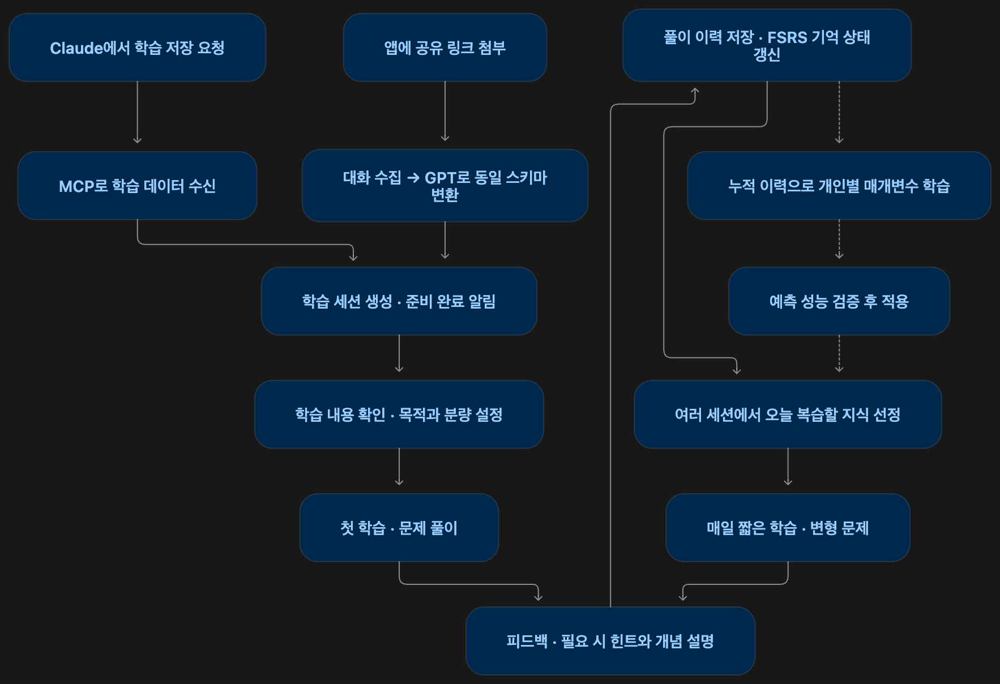
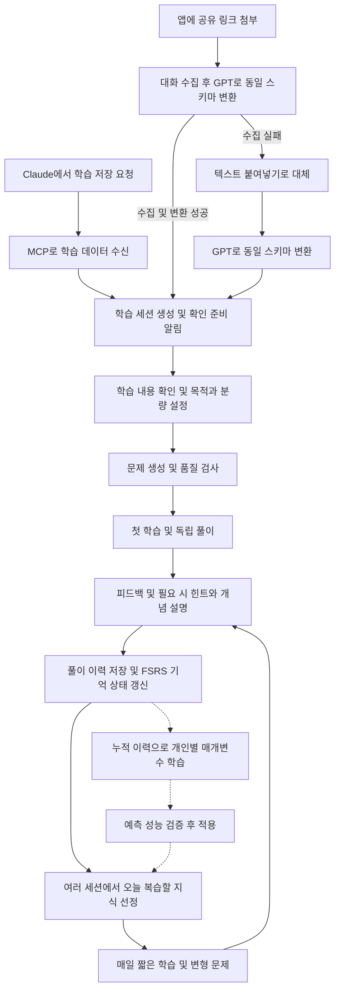

# 전체 사용자 학습 흐름

> AI에게 물어본 것을, 내 지식으로 남긴다.

- 작성일: 2026-09-28
- 문서 상태: 사용자 흐름 설계안. 구현 완료 여부를 나타내는 문서는 아니다.
- 범위: 대화 등록, 첫 학습, 매일 문제 선정, 개인별 FSRS 매개변수 학습
- 관련 문서: [플랫폼 기획 및 커넥터 스키마](ai-conversation-learning-review-platform.md)

## 1. 제품 목표

AI 대화를 매일의 맞춤형 학습으로 연결하는 개인 지식 유지 플랫폼이다. 사용자가 AI에게 물어본 지식을 일회성 답변으로 끝내지 않고, 시간이 지나도 기억하고 활용할 수 있도록 돕는다.

핵심 경험은 다음과 같다.

> AI에게 배운 내용을 저장하고, 매일 준비된 문제를 짧게 푼다. 사용할수록 내가 무엇을 얼마나 오래 기억하는지가 반영되어 오늘 필요한 문제가 달라진다.

오개념과 오답은 복습 필요성을 판단하는 신호다. 학습 대상에는 이전에 맞혔지만 복습 시점이 된 지식도 포함한다.

FSRS 활용의 중심은 **사용자의 풀이 이력과 경과 시간을 바탕으로 매일 복습할 지식을 선정하는 것**이다. 기억 게이지나 통계 화면은 이를 보조하는 기능이다.

## 2. 전체 흐름



<details>
<summary>상세 흐름도 · Mermaid 원본</summary>



</details>


실선은 사용자의 반복 학습 흐름이고, 점선은 별도로 진행하는 개인별 모델 학습이다. 사용자는 매개변수 학습을 직접 실행하거나 설정할 필요가 없다.

## 3. 대화를 앱으로 가져오기

### 3.1 Claude MCP 커넥터

1. 최초 한 번 Claude에 서비스 커넥터를 연결하고 계정을 연동한다.
2. Claude에서 평소처럼 학습 대화를 나눈다.
3. 사용자가 “이 내용 공부하게 학습에 넘겨줘”라고 요청한다.
4. Claude가 `save_learning_session`을 호출해 사용자 발화와 복습 단위를 전달한다.
5. 서버가 스키마를 검증하고 수신을 접수한다.
6. 후속 검수와 세션 준비는 비동기로 진행한다.

입력은 기존 v5 스키마를 사용한다. FSRS 상태를 커넥터가 작성하게 하지 않는다. 대화 내 AI 판정은 추출된 학습 신호이며 실제 앱 풀이 결과와 구분한다.

커넥터가 보낸 발화는 모델이 옮겨 적은 `model_transcribed` 데이터다. 앱에서 누락이나 변경 여부를 확인하고 수정할 수 있어야 한다. 커넥터는 저장 기능만 제공하며 문제 풀이와 피드백은 앱에서 진행한다.

### 3.2 공유 링크 및 붙여넣기

1. 사용자가 앱에 학습 대화의 공유 링크를 붙여 넣는다.
2. 서버가 공유된 대화를 수집한다.
3. GPT가 수집된 대화를 커넥터와 같은 스키마로 변환한다.
4. 구조 검증과 복습 단위 검수를 거쳐 학습 세션을 준비한다.
5. 링크 수집에 실패하면 텍스트 붙여넣기로 이어간다.

해커톤의 공유 링크 입력은 ChatGPT를 대상으로 한다. 수집 원문과 모델이 추출한 학습 내용을 구분해 보관하고, 추출 결과에는 원문 근거를 연결한다.

### 3.3 세션 생성과 알림

두 입력 경로는 같은 학습 흐름으로 합류한다.

```text
수신 접수 → 분석·검수 중 → 학습 내용 확인 가능 → 사용자 확인 → 문제 준비 → 첫 학습
```

확인할 내용이 준비되면 앱 알림을 제공한다.

> “인덱스와 잠금에 대한 학습 내용이 도착했어요. 공부할 내용을 확인해 보세요.”

이 알림은 복습 단위를 확인할 수 있다는 의미다. 문제 생성은 사용자가 내용을 확인한 이후에 수행한다.

## 4. 학습 내용 확인과 첫 학습 설정

사용자는 추출된 복습 단위와 핵심 지식을 확인하고 필요 없는 내용을 제외한다. 커넥터 수신 발화가 누락되거나 잘못 옮겨진 경우 수정할 수 있다. 수정된 내용은 문제 생성 전에 다시 검증한다.

설정은 다음과 같이 구성한다. 선택지와 시간 값은 화면 설계를 위한 예시다.

| 설정 | 예시 | 반영 대상 |
|---|---|---|
| 학습할 범위 | 인덱스의 역할, 잠금 범위, 격리 수준의 예외 | 학습 대상 지식 |
| 학습 목적 | 핵심 기억하기 / 원리 설명하기 / 실제 상황에 적용하기 | 문제 유형과 평가 목표 |
| 첫 학습 시간 | 3분 / 5분 / 10분 | 초기 문제 분량 |

앱은 지식 항목 수, 학습 목적, 예상 풀이·피드백 시간을 바탕으로 문제 수를 정한다. 풀이 중에도 조정할 수 있지만, 사용자가 설정한 시간 안에 마칠 수 있도록 분량 상한을 둔다. 다루지 못한 지식은 미학습 상태로 남겨 다음 학습에 연결한다.

학습 목적과 FSRS 목표 유지율은 구분한다. 실무 적용을 선택했다는 이유만으로 회상 확률 목표가 자동으로 높아지거나 숙달했다고 판단하지 않는다.

사용자가 확인한 내용을 바탕으로 LLM이 문제를 생성하고 Jev가 품질을 검사한다. 승인된 문제만 제공하며, 검사에 실패하면 재생성하거나 해당 항목의 출제를 보류한다.

## 5. 첫 학습과 단계적 피드백

### 5.1 도움 없는 첫 풀이

첫 학습은 각 지식을 도움 없이 답할 수 있는지 확인하는 과정이다. 답변을 정답 기준에 따라 판정하고, 최초의 유효한 풀이 결과로 지식 항목별 FSRS 상태를 초기화한다.

개인별 학습 기록이 없는 사용자는 기본 매개변수로 시작한다. 같은 매개변수를 사용하더라도 사용자별 풀이 결과와 복습 간격이 다르면 기억 상태와 다음 복습 시점은 달라진다.

대화의 `corrected`, `partial`, `restatement` 등의 신호는 첫 문제의 우선순위와 피드백 준비에 활용한다. 이를 곧바로 실제 복습 등급으로 변환하거나 복습 횟수에 포함하지 않는다.

### 5.2 힌트와 개념 설명

```text
도움 없이 답변
├─ 정답 → 짧은 피드백 → 다음 문제
└─ 오답 또는 모르겠음
    → 작은 힌트 → 재도전
    → 여전히 어려움 → 개념 설명
    → 짧은 확인 문제
    → 이후 도움 없는 재확인 대상으로 기록
```

반복해서 어려워하면 관련 선행 개념을 제안한다.

> “이 부분은 인덱스 탐색 과정을 먼저 확인하면 이해하기 쉬워요.”

추가 학습은 짧게 진행하거나 다음 학습으로 넘길 수 있게 한다. 반복 실패 항목 때문에 하루 학습 분량이 계속 늘어나지 않도록 한다.

### 5.3 기록과 평가 원칙

독립 풀이 결과와 도움을 받은 뒤의 결과를 별도로 기록한다.

- 도움 없이 맞힌 결과는 유효한 회상 성공으로 평가한다.
- 내용 힌트가 필요했던 최초 시도는 독립 회상 성공으로 처리하지 않는다.
- 힌트나 설명 후 맞혔다고 최초 실패 기록을 덮어쓰지 않는다.
- 같은 풀이 안의 힌트 재시도를 여러 번의 독립 복습으로 입력하지 않는다.
- 설명 직후의 확인 문제는 학습 진행으로 기록하고, 이후 도움 없는 재확인을 별도 복습으로 평가할 수 있다.
- 질문 오류나 낮은 판정 신뢰도가 있으면 기억 상태 갱신을 보류한다.

초기 등급 변환은 `Again`과 `Good` 중심으로 단순하게 시작할 수 있다. `Hard`와 `Easy`를 추가할 경우 독립 회상 여부를 유지하면서 구분 기준을 정한다. 느린 응답이나 힌트 사용을 무조건 `Hard`로 처리하지 않는다.

## 6. 첫 학습 완료와 매일 학습 진입

완료 화면에서는 확인한 지식과 이후 다시 확인할 내용을 보여준다.

> “오늘 5개 지식을 확인했어요. 도움이 필요했던 2개는 가까운 시점에 다시 확인할게요.”

사용자는 매일 학습할 시간과 원하는 알림 시간을 설정한다. 이후에는 이전 세션을 직접 찾지 않고 앱의 ‘오늘의 학습’으로 진입한다.

당일 재학습이 필요한 경우 별도의 짧은 재확인을 제공할 수 있다. 다음 날의 학습만으로 고정하지 않으며, 같은 풀이 안의 즉시 재시도와 구분한다.

## 7. FSRS 기반 매일 문제 선정

### 7.1 선정 단위

FSRS 상태는 사용자별 학습 항목에 연결한다. 각 항목은 무엇을 답할 수 있어야 하는지 명확한 평가 목표를 가진다.

- 핵심 사실과 관련 오개념이 같은 지식을 가리키면 하나의 학습 항목의 근거로 연결한다.
- 같은 평가 목표와 비슷한 난이도의 변형 문제는 기존 기억 이력을 이어받는다.
- 객관식 인식, 단답형 회상, 복합 응용을 모두 같은 능력으로 간주하지 않는다.
- 확인하지 않은 다른 지식까지 정답 처리하지 않는다.

기존 스키마의 `keyPoints`와 `confusionPoints`는 이 항목을 구성하는 입력 근거이며, 각각을 무조건 별도 FSRS 항목으로 만들지 않는다.

### 7.2 매일 학습 구성

1. 모든 세션의 활성 학습 항목에서 현재 기억 상태와 복습 시점을 계산한다.
2. 복습 시점이 된 지식과 당일 재학습이 필요한 지식을 후보로 구성한다.
3. 복습 필요성, 최근 독립 실패, 사용자 중요도를 반영해 후보의 우선순위를 정한다.
4. 미학습 지식은 복습 후보와 구분해 별도의 신규 학습 분량으로 편성한다.
5. 여러 세션에서 항목을 선택하고 예상 풀이·피드백 시간이 하루 예산에 맞도록 제한한다.
6. 선택된 지식을 확인할 기존 문제나 품질 검사를 통과한 변형 문제를 제공한다.
7. 풀이 결과를 저장하고 FSRS 상태를 갱신해 이후 선정에 반영한다.

| 포함 대상 | 선정 이유 |
|---|---|
| 이전에 틀린 지식 | 다시 학습한 내용을 독립적으로 기억하는지 확인 |
| 힌트나 설명이 필요했던 지식 | 도움 없이 답할 수 있는지 확인 |
| 전에 맞혔지만 복습 시점이 된 지식 | 시간이 지난 뒤에도 기억하는지 확인 |
| 아직 첫 학습을 하지 않은 지식 | 신규 학습을 진행하고 기억 상태를 형성 |

FSRS는 기억 상태와 복습 시점을 계산하는 기반이다. 그 후보 중 하루 분량을 선택하고 여러 세션을 섞는 것은 앱의 정책이다. 문제 선정 전체가 FSRS 자체에서 검증된 알고리즘이라고 표현하지 않는다.

### 7.3 지속 가능한 분량

- 잘 기억하는 지식은 복습 간격을 늘리고 어려운 지식은 더 가까운 시점에 확인한다.
- 서로 답을 알려주는 유사 문제는 분산하되, 같은 복습 단위라는 이유만으로 하루 하나로 제한하지 않는다.
- 반복 실패가 이어지면 선행 개념 설명이나 항목 분할로 학습 방식을 조정한다.
- 며칠 쉬었다 돌아와도 일일 분량 상한을 유지한다. 미처리 항목은 이후 큐로 이어진다.
- 시간 상한 때문에 복습이 밀릴 수 있으므로 목표 유지율 달성을 보장하지 않는다.
- 새 대화를 추가하면 같은 확인·첫 학습 과정을 거쳐 매일 학습에 합류한다.

사용자에게는 선택 이유를 짧게 보여줄 수 있다.

> “오늘의 학습 · 약 5분. 지난번 어려웠던 내용과 다시 확인할 시점이 된 내용을 준비했어요.”

## 8. 개인별 FSRS 매개변수 학습

### 8.1 개인화의 두 단계

| 구분 | 기본 매개변수 단계 | 개인별 학습 단계 |
|---|---|---|
| 계산 규칙 | 공통 기본 매개변수 사용 | 개인의 복습 이력으로 조정한 매개변수 사용 |
| 지식별 상태 | 각자의 풀이 결과와 간격에 따라 다름 | 각자의 이력과 개인별 매개변수에 따라 다름 |
| 적용 시점 | 첫 학습부터 | 기록을 축적하고 예측 개선을 검증한 이후 |

기본값만 사용해도 사용자별 문제 선정은 달라진다. 개인별 학습은 그 사용자가 기억하고 잊는 패턴에 맞게 계산 공식의 가중치를 조정하는 추가 단계다.

### 8.2 백그라운드 학습 흐름

```text
사용자별 복습 이력 축적
→ 항목별 시간순 이력으로 FSRS 옵티마이저 학습
→ 학습에 사용하지 않은 이후 기록으로 예측 성능 검증
→ 기본 매개변수와 현재 적용 중인 매개변수보다 개선되면 적용
→ 새 매개변수로 항목별 이력을 재계산
→ 기억 상태와 복습 시점 갱신
→ 이후 매일 문제 선정에 반영
```

학습 입력은 항목별 복습 시각, 실제 경과 시간, 평가 등급이다. 과거 이력에서 예측한 회상 확률과 실제 회상 성공·실패를 비교하고, 예측 오차가 줄어들도록 FSRS 매개변수를 조정한다.

학습 결과는 문제 목록이 아니라 개인별 매개변수 묶음이다. 스케줄러가 이 매개변수로 기억 상태를 계산하고 앱이 오늘의 문제를 선정한다.

풀이 직후에는 현재 적용 중인 매개변수로 상태를 갱신한다. 매개변수 학습은 별도의 주기 작업으로 수행한다. 기록이 부족하거나 예측 성능이 개선되지 않으면 기존 값을 유지한다.

### 8.3 기록과 검증

- 문제 제시 직전의 예측 회상 확률과 최초 독립 응답 결과를 보관한다.
- 힌트·설명 후 성공을 독립 회상 성공과 섞어 검증하지 않는다.
- 문제 ID와 학습 항목 ID, 평가 목표, 문제 유형을 연결해 기록한다.
- 판정 및 등급 변환 기준, 매개변수 버전을 추적할 수 있도록 한다.
- 미래의 풀이 결과가 과거 예측에 들어가지 않도록 시간순으로 학습·검증을 분리한다.

학습 실행 주기, 적용에 필요한 데이터 조건, 성능 개선 임계값은 구현 시 정할 운영 정책이다. 이 문서에서 특정 복습 횟수를 일률적인 학습 가능 기준으로 고정하지 않는다.

## 9. 역할 분리와 구현 연결

| 구성 요소 | 책임 |
|---|---|
| Claude 커넥터 | 현재 학습 대화의 발화와 복습 단위 전달 |
| 서버 LLM | 링크·붙여넣기 입력 추출, 문제·힌트·설명·변형 생성 |
| Jev | 복습 단위 검수, 문제 품질 검사, 답변 판정과 다음 행동 선택 |
| 앱 정책 코드 | 평가 등급 변환, 시간 예산, 큐 구성, 신규 학습 분량 관리 |
| FSRS 스케줄러 | 지식별 기억 상태 갱신과 복습 시점 계산 |
| FSRS 옵티마이저 | 복습 이력으로 개인별 매개변수 학습 |
| 검증·적용 작업 | 예측 성능 비교, 매개변수 버전 적용, 기존 상태 재계산 |
| 알림 | 학습 내용 도착 및 매일 학습 진입 안내 |

Java 백엔드의 스케줄러와 별도의 Python 최적화 작업을 연결하는 구성이 가능하다. 학습과 계산에 사용하는 FSRS 버전을 맞추고 학습된 매개변수와 검증 결과를 함께 관리한다.

시간 이동 데모는 주입된 `Clock`을 사용한다. 예측된 복습 시점과 큐가 시간에 따라 달라지는 것을 보여주되, 시뮬레이션을 실제 장기 학습 효과나 실제 사용자별 학습 성과로 표현하지 않는다.

## 10. 사용자에게 전달할 서비스 설명

> AI에게 배운 내용을 앱에 넘겨주세요. 학습 목적에 맞게 문제를 풀고, 매일 짧게 복습할 수 있도록 필요한 내용을 준비합니다. 복습 기록이 쌓이면 개인의 기억 패턴을 학습해 오늘 필요한 문제를 더 개인화합니다.

## 참고 자료

- [FSRS 공식 개념 설명](https://github.com/open-spaced-repetition/awesome-fsrs/wiki/ABC-of-FSRS)
- [FSRS 최적화 원리](https://github.com/open-spaced-repetition/awesome-fsrs/wiki/The-mechanism-of-optimization)
- [Java-FSRS](https://github.com/open-spaced-repetition/java-fsrs)
- [Py-FSRS 옵티마이저](https://github.com/open-spaced-repetition/py-fsrs#optimizer-optional)
